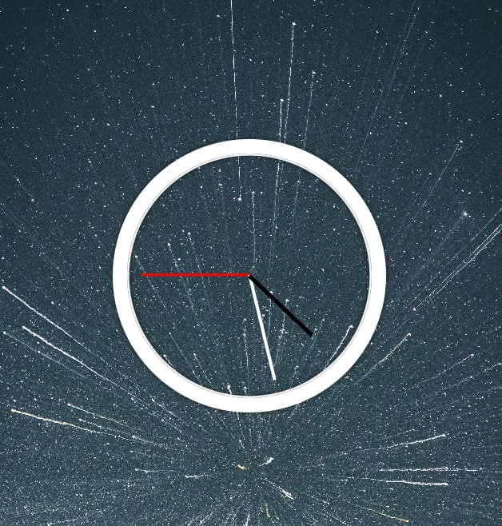

## MEMBUAT JAM ANALOG DENGAN JAVASCRIPT


untuk bisa mengikuti skema pembuatannya sebaiknya kita semua sudah mengerti soal HTML dan CSS dasar, karena dikesempatan kali ini kita tidak akan membahas pembuatan css dan HTML nya, melainkan hanya membahas soal bagaimana cara kita memasukan logic ke dalam codingan JavaScript kita.

semua materi yang ada disini berasal dari website [wesbos](https://javascript30.com/)
link official repo nya ada di [sini](https://github.com/wesbos/JavaScript30)

### Alur mengerjakan JavaScript nya  
- Tangkap class yang berhubungan dengan logic nya dengan menggunakan DOM selection dari HTML nya
- kemudian kita akan menggunakan method yang bernama set,interval
- kemudian kita akan membuat sebuah function yang nantinya didalm function tersebut kita akan memasukan logic yang akan diterapkan pada project kita kali ini.
- didalam function nya kita akan mengerjakan logic untuk jarum jam yang menunjukan detik, menit, dan jam nya

` untuk file HTML dan css nya kita menggunakan default dari website wesbos nya saja`   
seperti yang ada dibawah ini
##### HTML
```html
<!DOCTYPE html>
<html lang="en">
<head>
  <meta charset="UTF-8">
  <title>JS + CSS Clock</title>
  <link rel="stylesheet" href="style.css">
</head>
<body>

    <div class="clock">
      <div class="clock-face">
        <div class="hand hour-hand"></div>
        <div class="hand min-hand"></div>
        <div class="hand second-hand"></div>
      </div>
    </div>


  <script src="app.js"></script>
</body>
</html>
```
##### untuk CSS nya seperti yang ada dibawah ini
```css
html {
   background: url(./component/bg.jpg);
   background-size: cover;
   font-family: 'helvetica neue';
   text-align: center;
   font-size: 10px;
 }

 body {
   margin: 0;
   font-size: 2rem;
   display: flex;
   flex: 1;
   min-height: 100vh;
   align-items: center;
 }

 .clock {
   width: 30rem;
   height: 30rem;
   border: 20px solid white;
   border-radius: 50%;
   margin: 50px auto;
   position: relative;
   padding: 2rem;
   box-shadow:
     0 0 0 4px rgba(0,0,0,0.1),
     inset 0 0 0 3px #EFEFEF,
     inset 0 0 10px black,
     0 0 10px rgba(0,0,0,0.2);
 }

 .clock-face {
   position: relative;
   width: 100%;
   height: 100%;
   transform: translateY(-3px); /* account for the height of the clock hands */                    
}
.second-hand {
   width: 50%;
   height: 3px;
   background: white;
   position: absolute;
   top: 50%;
   transform-origin: 100%;
   transform: rotate(90deg);
   transition: all 0.05s;
   transition-timing-function: cubic-bezier(0.1, 2.7, 0.58, 1);
 }
 .min-hand {
   width: 50%;
   height: 4px;
   background: white;
   position: absolute;
   top: 50%;
   transform-origin: 100%;
   transform: rotate(90deg);
   transition: all 0.05s;
   transition-timing-function: cubic-bezier(0.1, 2.7, 0.58, 1);
   z-index: 1;
 }
.hour-hand {
   width: 40%;
   height: 6px;
   background: black;
   position: absolute;
   top: 50%;
   right: 50%;
   transform-origin: 100%;
   transform: rotate(90deg);
   transition: all 0.05s;
   transition-timing-function: cubic-bezier(0.1, 2.7, 0.58, 1);
   z-index: 2;
}
```
---
### kita langsung masuk kedalam coding JS nya
##### pertama sesuai skema yang sudah kita tulis diatas, kita akan menangkap semua class yang nanti akan kita gunakan untuk `DOM Manipulation`, kita namain saja `jarum(diikuti detik, menit, jam)`, seperti yang ada pada gambar dibawah ini
```javascript
const jarumDetik = document.querySelector('.second-hand')
const jarumMenit = document.querySelector('.min-hand')
const jarumJam = document.querySelector('.hour-hand')
```

##### kemudian kita akan membuat sebuah method interval waktu, seperti yang ada pada gambar dibawah ini.
```javascript
setInterval(function, 1000)
```
> pada method interval diatas mempunya 2 parameter yang harus diisi, yang pertama adalah function, dan yang kedua adalah periode waktu dengan ukuran milidetik (1000milidetik artinya 1detik)
> ini digunakan agar kita bisa menggerakan jarum jam detiknya

##### setelah kita membuat method waktu nya, sekarang kita akan membuat `functionnya` kita berii nama saja `jam` untuk pembuatan functionnya sebenarnya ada 2 cara.   
1. kita menggabungkannya dengan method interval, seperti yang ada pada gamabr dibawah ini
```javascript
setInterval(function jam() {

}, 1000)
```
2. atau kita bisa membuat nya secara terpisah.  
kalau kita membuatnya secara terpisah, pada method `intervalnya` parameter pertama nya diisikan nama functionnya, contoh nya seperti yang ada pada dibawah ini
```javascript
function jam() {

}
setInterval(jam, 1000)
```
> `dalam tutorial kali ini saya akan menggunakan cara yang pertama`  

##### selanjutnya kita akan membuat method lainnya didalam function untuk mengambil waktu terkini

```javascript
setInterval(function jam() {
   const terkini = new Date()

}, 1000)

``` nama variabelnya bebas mau di kasih nama apa saja, kali ini saya kasih nama nya `terkini`
```
##### kemudian kita akan membuat logic untuk detik nya
## DETIK
- kita buatkan sebuah variabel untuk menampung method waktu detiknya
```javascript
setInterval(function jam() {
   const terkini = new Date()

   const detik = terkini.getSeconds()

}, 1000)
```
- kemudian kita buatkan variabel lagi untuk menampung hasil matematik dari detiknya,
proses matematik nya akan menghasilkan titik koordinat pergerakan jarumnya
```javascript
setInterval(function jam() {
   const terkini = new Date()

   const detik = terkini.getSeconds()
   const derajatDetik = ((detik / 60) * 360) + 90


}, 1000)
```

- kemudian kita masukan kedalam DOM nya
```javascript
jarumDetik.style.transform = `rotate(${derajatDetik}deg)`
```
 ### kita lakukan hal yang sama untuk menit dan jam nya
 ## MENIT
 ```javascript
   const menit = terkini.getMinutes()
   const derajatMenit = ((menit / 60) * 360) + ((detik / 60) * 6) + 90
   jarumMenit.style.transform = `rotate(${derajatMenit}deg)`
```
## jam
```javascript
   const jam = terkini.getHours()
   const derajatJam = ((jam / 12) * 360) + ((menit / 60) * 30) + 90
   jarumJam.style.transform = `rotate(${derajatJam}deg)`
```
# soure JavaScript lengkapnya
```javascript
const jarumDetik = document.querySelector('.second-hand')
const jarumMenit = document.querySelector('.min-hand')
const jarumJam = document.querySelector('.hour-hand')

setInterval(function jam() {
   const terkini = new Date()
   // detik
   const detik = terkini.getSeconds()
   const derajatDetik = ((detik / 60) * 360) + 90
   jarumDetik.style.transform = `rotate(${derajatDetik}deg)`

   // menit
   const menit = terkini.getMinutes()
   const derajatMenit = ((menit / 60) * 360) + ((detik / 60) * 6) + 90
   jarumMenit.style.transform = `rotate(${derajatMenit}deg)`

   // jam
   const jam = terkini.getHours()
   const derajatJam = ((jam / 12) * 360) + ((menit / 60) * 30) + 90
   jarumJam.style.transform = `rotate(${derajatJam}deg)`
}, 1000)
```

