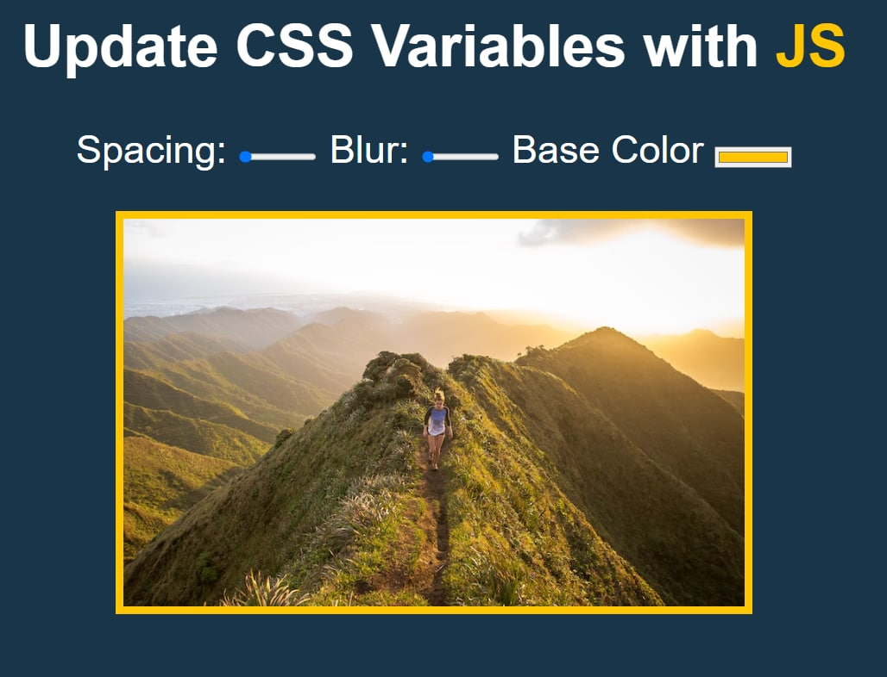
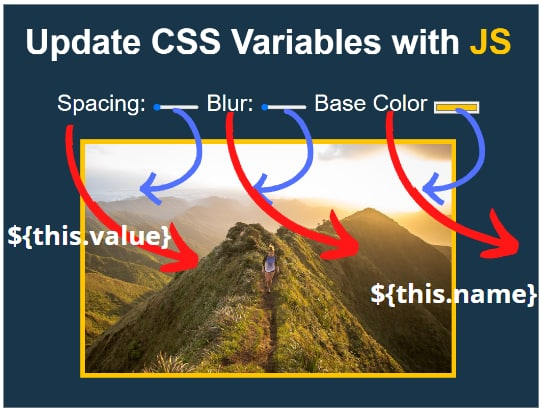

# MEMBUAT CSS BINGKAI DAN BLUR
___
   

project ini adalah hasil saduran dari website [wesbos](https://javascript30.com/) yang saya modifikasi sedikit, linknya bisa kalian klik dibawah  
officialWebsite : [website](https://courses.wesbos.com/account/access/633b15b97a4bee445f2a97c3/view/194130480)  
Github : https://github.com/wesbos/JavaScript30/tree/master/03%20-%20CSS%20Variables

### sebelum kita membuat project nya kita akan petakan dlu alur pembuatan nya
- kita akan bermain dengan CSS
- kita akan menggunakan pseudo class, global scope
- kita akan memanipulasi style menggunakan JavaScript

### mari kita langsung saja ke codingannya
pertama saya mempunyai sebuah HTML yang bentuk nya seperti yang ada dibawah ini
```html
<!DOCTYPE html>
<html lang="en">
<head>
  <meta charset="UTF-8">
  <title>Scoped CSS Variables and JS</title>
</head>
<body>
  <h2>Update CSS Variables with <span class='hl'>JS</span></h2>

  <div class="controls">
    <label for="spacing">Spacing:</label>
    <input id="spacing" type="range" name="spacing" min="10" max="200" value="10" data-sizing="px">

    <label for="blur">Blur:</label>
    <input id="blur" type="range" name="blur" min="0" max="25" value="10" data-sizing="px" >

    <label for="base">Base Color</label>
    <input id="base" type="color" name="base" value="#ffc600">
  </div>

  

</body>
</html>
```
#### kemudian kita akan membuat style dengan menggunakan css
dalam pengerjaannya dengan CSS kita akan bagi menjadi 2 tahap:  
##### Tahap pertama adalah styling basic
yang pertama yang akan kita lakukan adalah memberikan style ke body
```css
body {
      text-align: center;
      background: #193549;
      color: white;
      font-family: 'helvetica neue', sans-serif;
      font-weight: 100;
      font-size: 50px;
    }
```
> saya membuat css nya langsung di file HTML nya  
> untuk mmebuat css langsung didalam HTML nya, kita menuliskan code css nya didalam tag `<style> </style>`   

setelah kita memberikan styling ke body nya, kita akan lanjut memberik style ke class pembungkus dari label dan inputnya, yaitu class `controls`
```css
.controls {
      margin-bottom: 50px;
    }
```
> kita hanya memberikan style berupa margin bottom agar tulisan dan gambar nya berjarak atau tidak terlalu mepet

selanjutnya kita juga memberikan styling ke inputnya
```css
input {
      width: 100px;
    }
```
> saya memberikan style width 100px agar slider nya memenuhi semua bagannya

##### tahap kedua dengan CSS sedikit lebih kompleks
yaitu kita akan mencoba membuat sebuah variabel di lingkungan scope terluar/global dari element web kita
scope element web pada CSS ditandai dengan penggunaaan nama tag/class didepannya, adapun untuk global biasanya ditandai dengan sebuah tag special ada yang berupa `html {}` `*{}` ada juga dengan `root {}`

pada HTML 5 `root` merupakan scope element terluar dari web kita, jadi kali ini kita akan menggunakan root untuk menampung variabel yang akan kita buat nantinya, proses pembuatan variabel pada scope global ini juga akan menggunakan teknin `pseudo-class`, saya tidak akan menjelaskan lebih lanjut soal `pseudo-class` ini teman-teman bisa browsing di google soal lengkapnya.

intinya dalam pembuatan root dengan pseudo-class nanti akan ditandai dengna pemberian tanda titik 2 : didepan nama element nya.

kita langsung masuk saja ke codingannya
```css
:root {
      --spacing: 10px;
      --blur: 10px;
      --base: #ffc600;
    }
```
> - pemberian variabel pada scope terluar element ini bertujuan agar mempermudah kita ketika melakukan manipulasi dengan JavaScript  
> - pembuatan variabel didalam CSS syntax nya adalah memberikan tanda garis datar 2x didepan nama variabel nya, contoh nya seperti `--spacing` artinya kita ingin membuat variabel bernama spacing.  
> - untuk penamaan kali ini saya sesuaikan dengan nama yang saya berikan di tag input pada HTML nya, agar mempermudah saya untuk penerapan logic kedalam JavaScript nya  
> - kemudian saya berikan nilai default pada variabel nya, pemberian nilai default ini juga saya sesuaikan juga dengan value yang saya berikan di `input` pada HTML nya
___
sekarang kita akan mencoba menggunakan dan memanggil variabel yang sudah kita buat diatas.   
kita akan melakukan styling pada gambar nya terlebih dahulu dan menerapkan variabel yang kita buat diatas
```css
img {
      padding: var(--spacing);
      background: var(--base);
      filter: blur(var(--blur));
    }
```
> - variabel yang sudah kita buat diatas saya simpan kedalam `padding, background, dan filter`
> - untuk memanggil variabel nya kita perlu menuliskan syntax berupa `var()` nanti nama variabelnya kita taro kedalam tanda kurung var nya

penerapan variabel ini juga bertujuan agar ketika kita melakukan manipulasi styling nya menggunakan JavaScript pada scope global nya, maka styling pada gambar akan mengikuti perubahan global tersebut.

jadi nilai yang ada pada `:root` akan sama dengan yang ada pada gambar nya.
___
selanjutnya kita juga akan memberikan styling pada tulisan `JS`, styling ini akan mengikuti warna yang akan kita terapkan pada bingkai fotonya, untuk melakukan ini juga kita masih menggunakan pemanggilan variabel yang ada pada `:root`
```css
.hl {
      color: var(--base);
    }
```
> - disini karena saya hanya ingin memberikan styling berupa warna ke tulisan `JS` maka saya hanya memberikan variabel warna kedalam styling nya 

sampai disini kita sudah menyelesaikan tahapan kita untuk styling CSS nya, selanjutnya kita akan memberikan logic kedalam input atau slider yang ada pada web app kita
____

#### Tahapan JavaScript
> penulisan JavaScript nya juga saya lakukan langsung kedalam file HTML nya, untuk penulisannya saya menulisnya didalm langsung didalam tag `<script></script>`

yang pertama yang akan kita lakukan pada tahap ini adalah mengambil semua element pembungkus input nya dengan menggunakan DOM Selection, kali ini saya menggunakan `document.querySelectorAll()`
```javascript
const bingkai = document.querySelectorAll('.controls input')
```
> `.controls` adalah nama class dari pembungkusnya  
> `input` adalah nama tag yang ada didalam class controls nya , kenapa kita mengambil input, karena sebenarnya yang akan kita manipulasi adalah input nya, makanya ketika kita membuat variabel pada pseudo-class css nama dan nilai defaultnya kita sesuaikan dengan yang ada pada input nya

selanjutnya kita akan melakukan looping atau pengulangan untuk setiap element yang kita dapatkan tadi, untuk loopingnya saya menggunakan method `forEach()`
```javascript
 bingkai.forEach(i => i)
 ```
 > i adalah nama variabel yang kita buat, untuk nama nya bisa kita tulis/berikan dengan apa saja yang kita mau

 selanjutnya kita akan memberikan event langsung kedalam pengulangan foreach nya
 ```javascript
 bingkai.forEach(i => i.addEventListener('input', function(){
      
    }))
```
> `input` adalah nama event nya, event pada Javascript ada banyak diantaranya
> >- mouseclick = ketika mouse di klik
> >- keydown = ketika tombol keyboard di tekan
> >- input = mengembalikan nilai kepada DOM nya
> >- dll

> didalam event nya juga membutuhkan parameter kedua yang berupa function, didalam function inilah kita akan memasukan logic untuk manipulasi styling nya

selanjutnya yang akan kita lakukan adalah kita akan menangkap `data-property` yang ada pada inputnya didalam HTML nya data-property method nya disebut dengan `dataset`  

kemudian kita membuat sebuah variabel didalam function yang nantinya variabel ini akan menyimpan hasil dari seleksi `data-property` nya.   

jika kita lihat pada HTML nya, data-ptoperty nya bernama data-sizing, 
> `data` adalah inisialisasi data-property   
> `sizing` adalah nama yang kita berikan untuk data property nya

untuk pembuatannya bisa dilihat pada codingan berikut ini
```javascript
bingkai.forEach(i => i.addEventListener('input', function(){
      const px = this.dataset.sizing || '';
    }))
```
> `px` adalah nama variabel nya   
> `this` adalah method yang ada pada function untuk memanggil semua data yang diterima function  
> `dataset` adalah method untuk data-property   
> `sizing` adalah nama property yang kita berikan di tag input pada HTML nya   
> `||` adalah sebuah operator yang disebut `OR` ini digunakan jika kita ingin menerapkan sesuatu berdasarkan nilai yang kita ambil tetapi salah satu elementnya tidak mempunya data tersebut, lebih lengkapnya bisa kita lihat pada penjelasn dibawah   
> `''` adalah string kosong

jika kita lihat lagi didalam HTML nya, terdapat 3 tag input didalamnya tetapi tidak semua input memiliki `data-property`, hanya 2 input yang memiliki data property, untuk itulah kita menggunakan operator `||` jadi cara baca lengkapnya gini

ambil semua `data-property` yang ada di tag `input`, jika ada input yang tidak memiliki data property maka isikan saja nilai atau string kosong ketika mengembalikan nilai nya
---

langkah terakhir kita tinggal meranggkai dan memasukan nya kembali semua data interaksi user kedalam css dan html nya, untuk melakukan itu, codingannya seperti berikut ini
```javascript
bingkai.forEach(i => i.addEventListener('input', function(){
      const px = this.dataset.sizing || '';
      document.documentElement.style.setProperty(`--${this.name}`, this.value + px)
    }))
```
penjelasan
>- `document` adalah scope global dari Javascript, artinya kita akan menerapkan JavaScriptnya pada element terluar dari CSS dan HTML nya   
>- `documentElement` adalah method agar kita bisa memberikan manipulasi pada scope `document` nya
>- `setProperty` adalah kita ingin menambahkan `data-property` ke dalam DOM nya set property menerima 2 parametr
>- `${this.name}` seperti yang saya bilang tadi bahwa this adalah method dari function untuk memanggil semua data yang diterima function, penulisan this selalu diikuti dengan nama data yang ingin kita ambil, seperti contoh nya kali ini kita menuliskan `name` artinya kita akan mengambil nama yang kita terima dari interaksi user dengan web kita, contoh penjelasan lebih lengkapnya kira kira seperti dibawah ini
>>> jadi ketika user menggeser slider pada spacing, maka function akan menerima data bahwa `spacing` telah melakukan interaksi dengna user, begitupun ketika kita menggeser slider blur, atau memilih warna untuk bingkainya, maka function akan menerima nama nilai yang berinteraksi dengan user, inilah yang kita ambil menggunakan `${this.name}`
>- `this.value` kasusnya sama dengan this.name, tapi kali ini yang diambil adalah adalah nilai dari slider yang digerakan user, ataupun warna yang dipilih user
>- yang terakhir kita tambahkan variabel px agar ketika dikembalikan ke css atau HTML nya bisa langsung diterapkan

mari kita ilustrasikan dengan foto misal   

  

> panah merah adalah ${this.name}  
> panah biru adalah this.value   

jadi nanti yang terjadi adalah JavaScript akan menggabungkan data yang dilakukan oleh user pada bagaian yang saya beri tanda panah tersebut, nanti akan didapati sebuah nilai berupa, `nama, nilai koordinat slider atau nilai warna yang dipilih` kedua hal ini akan digabungkan dengan tulisan px yang ada pada data Property yang sudah kita tangkap dengan variabel px

contoh nya :

user menggerakan blur slider sampai ketengah tarolah nilai tengah pada slider adalah 15, kemudian terakhir kita tambahkan variabel px nya, berarti yang kita dapat dan akan kita rangkum dan dikembalikan ke css nya seperti ini   
`--slider: 15px`   
---

semoga bisa dipahami, saya juga agak kesulitan untuk menjelaskannya wwkwkwk
________
### SOURCE LENGKAP
```html
<!DOCTYPE html>
<html lang="en">
<head>
  <meta charset="UTF-8">
  <title>Scoped CSS Variables and JS</title>
</head>
<body>
  <h2>Update CSS Variables with <span class='hl'>JS</span></h2>

  <div class="controls">
    <label for="spacing">Spacing:</label>
    <input id="spacing" type="range" name="spacing" min="10" max="200" value="10" data-sizing="px">

    <label for="blur">Blur:</label>
    <input id="blur" type="range" name="blur" min="0" max="25" value="10" data-sizing="px" >

    <label for="base">Base Color</label>
    <input id="base" type="color" name="base" value="#ffc600">
  </div>

  

  <style>
    /* manipulasi gambarnya */
    :root {
      --spacing: 10px;
      --blur: 10px;
      --base: #ffc600;
    }
    img {
      padding: var(--spacing);
      background: var(--base);
      filter: blur(var(--blur));
    }
    .hl {
      color: var(--base);
    }

    /*
      Pembatas 
    */

    body {
      text-align: center;
      background: #193549;
      color: white;
      font-family: 'helvetica neue', sans-serif;
      font-weight: 100;
      font-size: 50px;
    }

    .controls {
      margin-bottom: 50px;
    }

    input {
      width: 100px;
    }
  </style>

  <script>
    const bingkai = document.querySelectorAll('.controls input')
    
   
      bingkai.forEach(i => i.addEventListener('input', function(){
      const px = this.dataset.sizing || '';
      document.documentElement.style.setProperty(`--${this.name}`, this.value + px)
    }))
  </script>


</body>
</html>
```